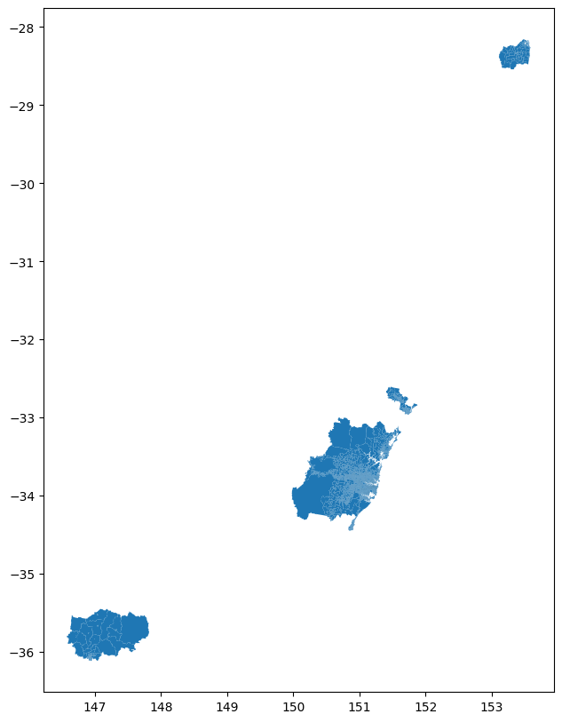
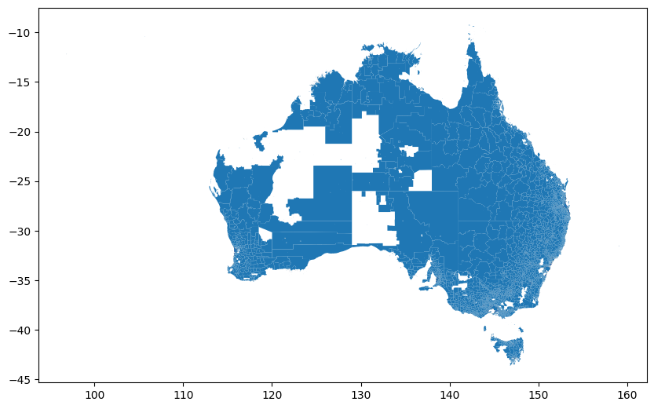
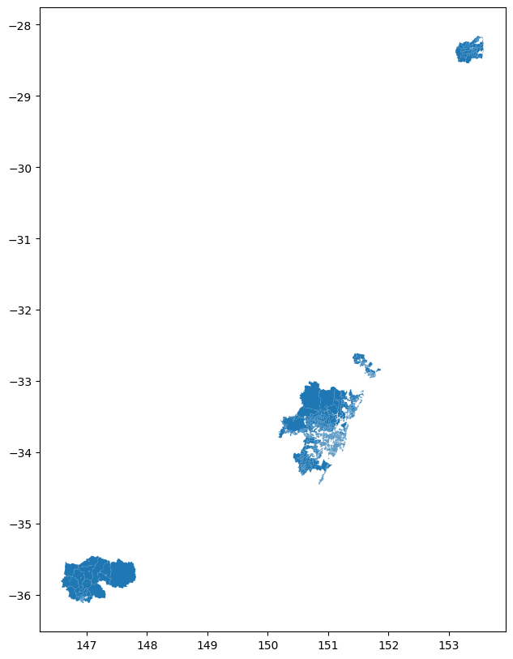

# AusUrbHI
This is the repository for scripts generated for the Australian Urban Health Indicator (AusUrbHI) project. The study aims to analyze the number and cause of emergency department (ED) presentations, hospitalizations, and deaths during a heatwave using person-level deidentified linked health data. The methodology involves determining the health component of the sensitivity sub-indicator, normalizing and categorizing variables, and conducting a Poisson multivariable regression to calculate the Heat Vulnerability Index (HVI) score. Spatial smoothing will be applied to the geographic data to protect data privacy and ensure statistical stability while adjusting for age, sex, and comorbidities. The resulting heat health vulnerability indicator will reveal the relative vulnerability of locations across the study area, and hotspot analysis will be performed to investigate statistically significant locations of heat health vulnerability. This comprehensive approach combines statistical methods and spatial analysis techniques to provide valuable insights into heat health vulnerability.

    
     
    <em>Project diagram</em>

    
     
    <em>Systen e-Infrastructure</em>

## Aurin Datasets Preparation
Scripts for obtaining and derive the study area data for HVI and urban liveability case studies.

    
     
    <em>Study area</em>

    
     
    <em>Data</em>

    
     
    <em>Refined data</em>

## Data Preprocessing and Cleansing
1. Obtain data from sources such as the [AURIN Data Provider](https://data.aurin.org.au/) or the [ABS GeoPackages downloader](https://www.abs.gov.au/census/find-census-data/geopackages?release=2021&geography=AUST&table=G01&gda=GDA2020). Make sure the data is in shapefile or geojson format.
2. study area refinement using scripts under /study_area_refinement.
3. convert to 2021 ASGS standard using scripts under /2016_to_2021_concordance with concordance files.
4. perform disaggregation to ensure all data is at SA1 level using scripts under /disaggregation. Three disaggregation algorithms are used: divided by number of subdivision regions, by population, and no division.

## Surface Raster Processing
raster input: 
	2m surface rasters in NSW
	two 30m surface rasters ACTNSW_SURFACECOVER_30M_Z55.tif and Z56.tif (others are not interesting with the study area)

preprocess 30m raster
- [x] clip the two 30m rasters with study area
- [x] resample the rasters to 2m

mosaic dataset creation
- [x] create a mosaic dataset in GDA94
- [x] add all rasters (original 30m and 2m) to it
- [x] avoid duplicated count from overlapping regions by setting Mosaic rule (By Attribute)

derive landuse shapefile
- [x] reclassify symbology to value with 0-12 from 256 (stretch -> discrete)
- [x] zonal histogram analysis
- [x] convert to shapefile
- [x] manual validation and change field name

## Building Point Cloud Processing
The building footprint processing methodology consists of three steps. 
1.	Hole Removal: A BuildingHoleRemover class is initialized with an input shapefile of building polygons. It reads the shapefile, removes small holes from the building polygons based on a minimum area, and saves the processed polygons to a new shapefile.
2.	Rebuffering: A BuildingReBuffer class is initialized with the input shapefile of processed building polygons. It applies a buffer to the building polygons and saves the buffered polygons to a new shapefile.
3.	Regularization: A regularize_building_footprints function takes an input feature class of building footprints, simplifies them using the Simplify Building tool in ArcGIS Pro, and saves the regularized footprints to an output feature class.
An example result of the approach is shown below:

    
     
    <em>Process building point cloud data</em>

    
     
    <em>Comparison of processing result</em>

datasets:

- OSM building for urban area data.
- Microsoft building footprint data for rural area.
- NSW spatial service building point cloud data for cross-reference.

## Land Surface Temperature (LST) Data Cube Building and Excess Heat Factor (EHF) Calculation
Calculating EHF (excess heat factor - https://www.mdpi.com/1660-4601/12/1/227) for identifying heatwave periods.

The approach consists of two steps. In the first step, we obtain MODIS data containing minimum and maximum daily/nighttime temperatures for all SA1 areas in the study area within NSW, Australia. We use the Google Earth Engine API to load the MODIS data collection for temperature data, specifically using the MOD11A1 dataset for daily land surface temperature data. Then, we extract the minimum and maximum daily/night time temperature bands from the MODIS data collection and calculate the minimum and maximum temperatures for the study area. Finally, we clip the temperature data to export the data as a NetCDF file.

(in progress) In the second step, we plan to use Excess Heat Factor (EHF) to identify heatwaves in the study area. The EHF is calculated using the temperature data to determine the severity of a heatwave event. It comprises two components: the first is the Excess Heat Index (EHI), which measures the deviation of the daily temperature from the average temperature of the previous 30 days, and the second is the Acclimatization Index (AI), which measures how well the population is adapted to the current heat conditions. Combine these two indices to calculate the EHF. To identify heatwaves, we plan to apply a threshold to the EHF values, such as using the 90th percentile or another appropriate threshold for your study. By analyzing the EHF values over time and across the SA1 areas in the study area within NSW, Australia, we will then be able to identify periods and locations of heatwaves, enabling better planning and mitigation strategies for public health and safety.
We choose to use NetCDF data cube rather than common file formats such as csv, geojson, or shapefile. This is because the NetCDF data cube format is better suited for storing the MODIS temperature data, as it can efficiently handle the continuous, multidimensional nature of the dataset and provide convenient access to the data and metadata.

    
     
    <em>An example datacube shown in QGIS</em>

Here is the list of datasets we are planning to use and compare the results.

| Dataset   | Spatial Resolution     | Temporal Resolution                                      |
|-----------|------------------------|----------------------------------------------------------|
| MODIS     | 250m - 1km             | Daily, 8-day, 16-day, and monthly (depending on product) |
| Landsat-8 | 15m - 100m             | 16 days                                                  |
| BOM       | Varies (station-based) | Daily, monthly, and annual                               |
| ERA5      | ~31km                  | Hourly                                                   |

**MODIS (Moderate Resolution Imaging Spectroradiometer)** provides data with a spatial resolution ranging from 250 meters to 1 kilometer, depending on the specific product. The temporal resolution varies as well, with daily, 8-day, 16-day, and monthly options available.

**Landsat-8** offers data with a spatial resolution of 15 meters for the panchromatic band, 30 meters for the visible and near-infrared bands, and 100 meters for the thermal infrared bands. Landsat-8 has a 16-day repeat cycle, which means it captures data for the same location every 16 days.

**BOM** (Bureau of Meteorology, Australia) provides weather station-based data, and its spatial resolution varies depending on the density and distribution of weather stations. BOM data is typically available on daily, monthly, and annual timescales.

**ERA5**, a reanalysis dataset produced by the European Centre for Medium-Range Weather Forecasts (ECMWF), has a spatial resolution of approximately 31 kilometers. It provides data at an hourly temporal resolution.

**BOM** The heatwave data (EHF) is available from late 2018 on wards only.

## SNOMED-CT-AU to ICD-10 Mapping
The package performs code mapping between SNOMED-CT-AU and ICD-10. The methodology involved mapping SNOMED CT codes to ICD codes using a mock-up dataset with 4,000+ entries. Four steps were taken: 1) using Snapper to resolve synonyms and unofficial names, 2) using SnoMap, 3) using the IHTSDO international SNOMED mapping tool for cross-validation, and 4) using the I-MAGIC mapper, which resolved some unmatched entries. The final result was 99.68% recall, with 13 unmatched codes.
However, there are risks associated with the process: 1) the actual dataset might not be as clean as the mock-up, 2) the size of the real dataset is unknown and may affect tool usability, 3) precision has not been checked, making validation difficult, 4) a coder with professional knowledge may be required to resolve unmatched entries and disambiguate multi-match cases, and 5) differences between the Australian and international versions of the codes may impact the reliability of the results from international tools. In conclusion, the methodology achieved a high recall rate, but further validation and professional expertise may be needed to ensure accurate results.

    
     
    <em>The SnoMap tool</em>

    
     
    <em>The IHTSDO international SNOMED mapping tool</em>

    
     
    <em>The I-MAGIC tool</em>

 
