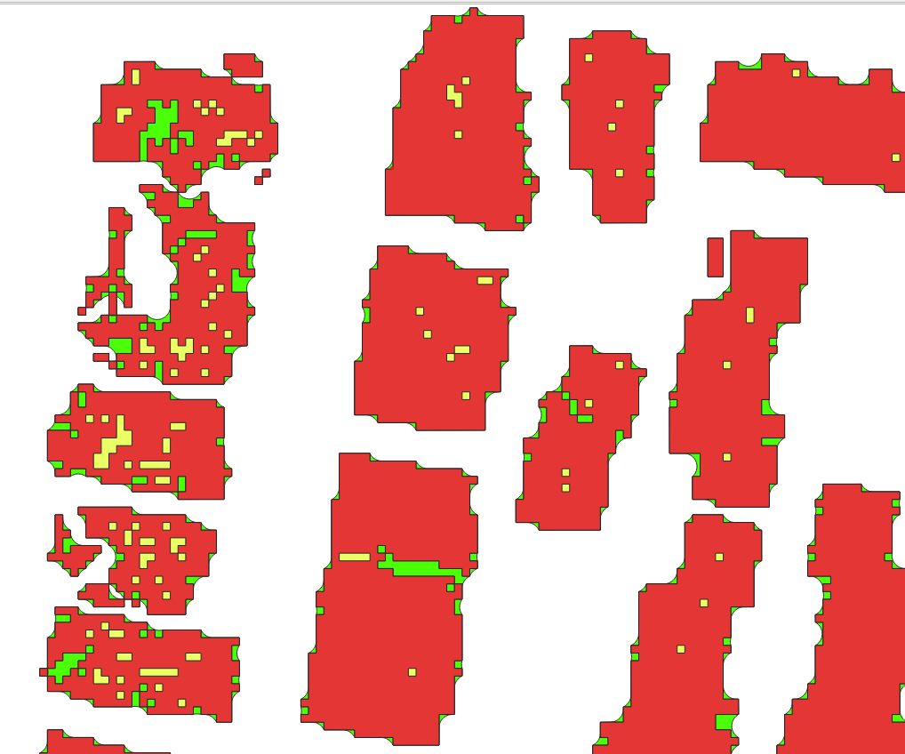
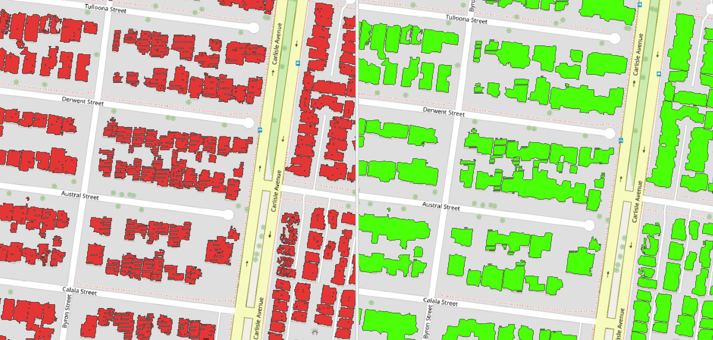

# AusUrbHI
Repository for scripts generated for the Australian Urban Health Indicator (AusUrbHI) project.

## aurin_datasets
Including derive the study area for HVI and urban liveability case studies as shapefile.  

### HVI and Urban Liveability

### Cancer Atlas

## building_point_cloud
Cleanse building point cloud data.

datasets:

OSM building for urban area data.

Microsoft building footprint data for rural area.

NSW spatial service building point cloud data for cross-reference.

## excess_heat_factor
Calculating EHF (excess heat factor - https://www.mdpi.com/1660-4601/12/1/227) for identifying heatwave periods.

| Dataset   | Spatial Resolution     | Temporal Resolution                                      |
|-----------|------------------------|----------------------------------------------------------|
| MODIS     | 250m - 1km             | Daily, 8-day, 16-day, and monthly (depending on product) |
| Landsat-8 | 15m - 100m             | 16 days                                                  |
| BOM       | Varies (station-based) | Daily, monthly, and annual                               |
| ERA5      | ~31km                  | Hourly                                                   |

**MODIS (Moderate Resolution Imaging Spectroradiometer)** provides data with a spatial resolution ranging from 250 meters to 1 kilometer, depending on the specific product. The temporal resolution varies as well, with daily, 8-day, 16-day, and monthly options available.

**Landsat-8** offers data with a spatial resolution of 15 meters for the panchromatic band, 30 meters for the visible and near-infrared bands, and 100 meters for the thermal infrared bands. Landsat-8 has a 16-day repeat cycle, which means it captures data for the same location every 16 days.

**BOM** (Bureau of Meteorology, Australia) provides weather station-based data, and its spatial resolution varies depending on the density and distribution of weather stations. BOM data is typically available on daily, monthly, and annual timescales.

**ERA5**, a reanalysis dataset produced by the European Centre for Medium-Range Weather Forecasts (ECMWF), has a spatial resolution of approximately 31 kilometers. It provides data at an hourly temporal resolution.

## snomed_icd
Perform code mapping between SNOMED-CT-AU and ICD-10.
