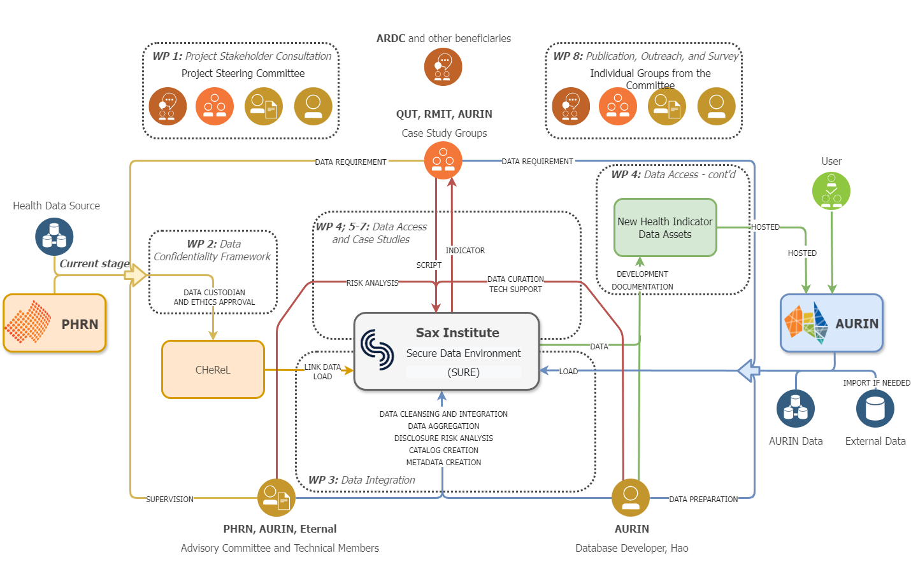
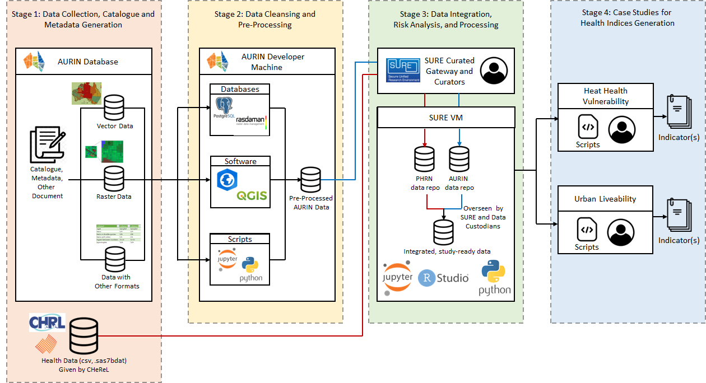
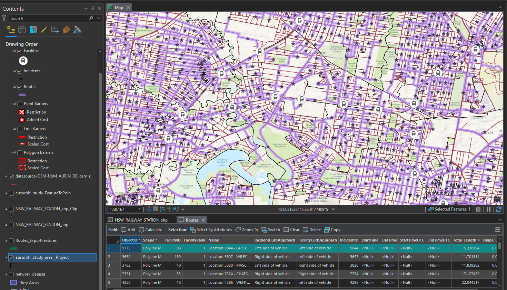

# AusUrbHI Heat Vulnerability and Urban Livability Case Study Documentation Archive
This is the repository for scripts and supporting documents generated for the Australian Urban Health Indicator (AusUrbHI) project. The study aims to analyze the number and cause of emergency department (ED) presentations, hospitalizations, and deaths during a heatwave using person-level deidentified linked health data. The methodology involves determining the health component of the sensitivity sub-indicator, normalizing and categorizing variables, and conducting a Poisson multivariable regression to calculate the Heat Vulnerability Index (HVI) score. Spatial smoothing will be applied to the geographic data to protect data privacy and ensure statistical stability while adjusting for age, sex, and comorbidities. The resulting heat health vulnerability indicator will reveal the relative vulnerability of locations across the study area, and hotspot analysis will be performed to investigate statistically significant locations of heat health vulnerability. This comprehensive approach combines statistical methods and spatial analysis techniques to provide valuable insights into heat health vulnerability. The repository is structured as shown below.

    ├── scripts
    ├── documentation
        ├── data_catalogue_and_metadata
        ├── linked_health_data_application_and_documents (sensitive and not publicly awailable)
    ├── img

    
     
    <em>Source: http://www.bom.gov.au/state-of-the-climate/australias-changing-climate.shtml</em>

    
     
    <em>Project diagram</em>

    
     
    <em>Systen e-Infrastructure</em>

## Study area

    
     
    <em>Case Study Area</em>

Population:

Greater Sydney - 4.8 million \
Wollongong - 0.3 million \
Newcastle - 0.17 million \
Maitland - 0.5 million \
Tweed heads - 0.65 million \
Albury - 0.05 million

## Key Datasets
### AURIN ABS Socio-Demographic Datasets
- Obtained from [AURIN Data Provider](https://data.aurin.org.au/) and the [ABS GeoPackages downloader](https://www.abs.gov.au/census/find-census-data/geopackages?release=2021&geography=AUST&table=G01&gda=GDA2020)
- ABS census 2016 and 2021
- ABS non-census datasets, e.g., SEIFA, income, etc.
- NATSEM indicators

### AURIN Health-Related Datasets
- PHIDU diseases, conditions, risk factors, etc.
- ABS Health & Disability
- NHSD health service locations
  - Density of numbers of GPs and EDs within buffered region

### Built and Natual Environment Data
- Geoscape
  - Buildings - roof height, material, cooling, building area, levels, swimming pools
  - surface cover - % of bare earth, road, vegetation, built-up, water, building ,etc.
  - closeness to hydro body, train station, and green space

### Temperature Data
- Longpaddock SILO
  - Average and max summer percentile deviation
  - Excess Heat Factor (EHF) average and maximum
  - Days and average duration of excess heat, heatwave, and extreme heatwave days

### SA1-Level Individual Record Linked Health Datasets
- APDC admitted-patient-data-coll: 298,120,88 records for 4,540,451 patients
- EDDC emergency-department-data-coll: 23,330,967 records for 4,273,272 patients
- CODURF cause-of-death-unit-record-file: 221,787 records for 221,751 patients
- RBDM registry-of-births-deaths-and-marriages-death-registrations: 264, 594 records for 264,530 patients

### RMIT Urban Observatory Livability Data
(Hidden unpublished content under review.)

## Data Pre-pocessing
### AURIN vector data processing
- transformation and spatialization if needed (e.g., NHSD)
- refinement to study area
- 2016 to 2021 ASGS concordance 
  - n:m mapping resolution
- Disaggreation (PHA and SA2 to SA1)
  - population based
  - number of sub-division area based
  - no division

    
     
    <em>SA1 Data Concordance</em>

### Temperature raster data cube building, storage, and analysis

    
     
    <em>Creating Land Surface Temperature Data Cube from Raster</em>

    
     
    <em>Deriving EHI and EHF to Identify Heat Days and Heat Waves</em>

EHF is calculated based on the definition and algorithm provided by BOM.

    
     
    <em>EHF Algorithm</em>

Datasets we initially planned to use:

| Dataset   | Spatial Resolution     | Temporal Resolution                                      |
|-----------|------------------------|----------------------------------------------------------|
| MODIS     | 250m - 1km             | Daily, 8-day, 16-day, and monthly (depending on product) |
| Landsat-8 | 15m - 100m             | 16 days                                                  |
| BOM/SILO  | Varies (station-based) | Daily, monthly, and annual                               |
| ERA5      | ~31km                  | Hourly                                                   |

**MODIS (Moderate Resolution Imaging Spectroradiometer)** provides data with a spatial resolution ranging from 250 meters to 1 kilometer, depending on the specific product. The temporal resolution varies as well, with daily, 8-day, 16-day, and monthly options available.\
**Landsat-8** offers data with a spatial resolution of 15 meters for the panchromatic band, 30 meters for the visible and near-infrared bands, and 100 meters for the thermal infrared bands. Landsat-8 has a 16-day repeat cycle, which means it captures data for the same location every 16 days.\
**BOM** (Bureau of Meteorology, Australia) provides weather station-based data, and its spatial resolution varies depending on the density and distribution of weather stations. BOM data is typically available on daily, monthly, and annual timescales.\
**Longpaddock SILO** Processed weather station data\
**ERA5**, a reanalysis dataset produced by the European Centre for Medium-Range Weather Forecasts (ECMWF), has a spatial resolution of approximately 31 kilometers. It provides data at an hourly temporal resolution.\
**BOM** The heatwave data (EHF) is available from late 2018 on wards only.\

Key processing steps:
- download max/min daily temperature netcdf files from 2010 to 2022
- merge nc to 2010_2022_max_temp.nc and 2011_2022_min_temp.nc
- refine to study area and buff by 0.5, fill nan value
- derive EHI, EHF, tx90, and tn90
- perform SA1 level analysis of the previously mentioned variables (e.g., days and average) and derive shapefile

### Geoscape building polygon data transformation and statistics

    
     
    <em>Building Data Statistics</em>

### Geoscape landcover raster data analysis integration and statistics

    
     
    <em>Land Cover Data Transformation and Statistics</em>

raster input include 2m surface rasters in NSW, as well as two 30m surface rasters ACTNSW_SURFACECOVER_30M_Z55.tif and Z56.tif (others are not interesting with the study area)

- preprocess 30m raster
  - clip the two 30m rasters with study area
  - resample the rasters to 2m
- mosaic dataset creation
  - create a mosaic dataset in GDA94
  - add all rasters (original 30m and 2m) to it
  - avoid duplicated count from overlapping regions by setting Mosaic rule (By Attribute)
- derive landuse shapefile
  - reclassify symbology to value with 0-12 from 256 (stretch -> discrete)
  - zonal histogram analysis
  - convert to shapefile (table to excel, and postprocessing)
  - manual validation and change field name

### Service area network distance analysis

    
     
    <em>NHSD service accessibility</em>

input: 
- osm line shapefile
- nhsd service location point shapefile

step (using ArcGIS Pro):
- make sure CRS is consistent, and refine shapefiles to sudy area
- create feature dataset in geodatabase, add the line data to it, and create network dataset
- Analysis (top task bar) -> Network Analysis -> Service Area
- build network dataset (right-click the dataset from geodatabase)
- service area layer (top task bar) -> import facilities 
- run service area analysis, save resulting polygons as <gp>/<ed>_polygons_<1000>/<2000>/<3000>.shp
- generating a shapefile with service accessibility (e.g., number of GPs within 1000m) divided by SA1 area (Python). This could be done with tools such as Spatial Join and Summary Statistics

    
     
    <em>Closest train stations from each SA1</em>

step changed (ArcGIS Pro):
- using Closest Facility instead of Service Area
- define train stations as facilities and SA1 centroids as incidents
- compute route length for each SA1 centroid to the closest train station

### Linked data curation, processing, and analysis

## Health Indices Generation

    
     
    <em>Indices and sub-indices</em>

    
     
    <em>Heat Health Indices Data</em>

    
     
    <em>Heat Health Indices Correlation</em>

## (Archived) Microsoft building footprint Building Point Cloud Data Processing
The building footprint processing methodology consists of three steps. 
1.	Hole Removal: A BuildingHoleRemover class is initialized with an input shapefile of building polygons. It reads the shapefile, removes small holes from the building polygons based on a minimum area, and saves the processed polygons to a new shapefile.
2.	Rebuffering: A BuildingReBuffer class is initialized with the input shapefile of processed building polygons. It applies a buffer to the building polygons and saves the buffered polygons to a new shapefile.
3.	Regularization: A regularize_building_footprints function takes an input feature class of building footprints, simplifies them using the Simplify Building tool in ArcGIS Pro, and saves the regularized footprints to an output feature class.
An example result of the approach is shown below:

    
     
    <em>Process building point cloud data</em>

    
     
    <em>Comparison of processing result</em>

## (Archived) SNOMED-CT-AU to ICD-10 Mapping
The package performs code mapping between SNOMED-CT-AU and ICD-10. The methodology involved mapping SNOMED CT codes to ICD codes using a mock-up dataset with 4,000+ entries. Four steps were taken: 1) using Snapper to resolve synonyms and unofficial names, 2) using SnoMap, 3) using the IHTSDO international SNOMED mapping tool for cross-validation, and 4) using the I-MAGIC mapper, which resolved some unmatched entries. The final result was 99.68% recall, with 13 unmatched codes.
However, there are risks associated with the process: 1) the actual dataset might not be as clean as the mock-up, 2) the size of the real dataset is unknown and may affect tool usability, 3) precision has not been checked, making validation difficult, 4) a coder with professional knowledge may be required to resolve unmatched entries and disambiguate multi-match cases, and 5) differences between the Australian and international versions of the codes may impact the reliability of the results from international tools. In conclusion, the methodology achieved a high recall rate, but further validation and professional expertise may be needed to ensure accurate results.

    
     
    <em>The SnoMap tool</em>

    
     
    <em>The IHTSDO international SNOMED mapping tool</em>

    
     
    <em>The I-MAGIC tool</em>

 
